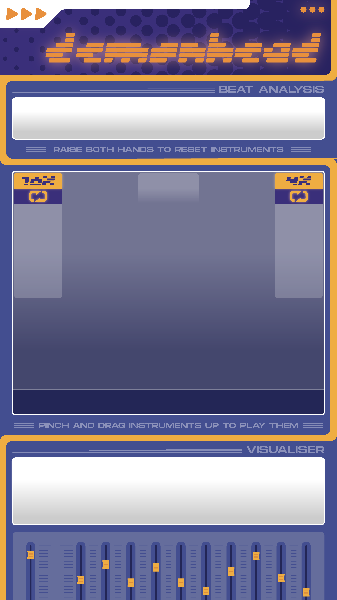

# Demonhead Drum Machine

An interactive music creation experience that uses hand gestures and physics-based interactions to create dynamic musical compositions.

## How to Use

### Getting Started

1. Allow camera access when prompted (required for hand tracking)
2. Wait for all assets to load (indicated by the loading screen)
3. Press 'h' to toggle the settings panel

### Basic Controls

#### Hand Gestures

- **Pinch Gesture**: Make a pinching motion with your thumb and index finger to grab instruments
- **Release**: Open your fingers to release the instrument
- **Throw Left**: Throw instruments to the left side for 16-beat loops
- **Throw Right**: Throw instruments to the right side for 4-beat loops
- **Raise Both Hands**: Lift both hands above the top boundary to clear all active instruments

#### Keyboard Controls

- **H Key**: Toggle settings interface
- **Click/Tap**: Required initially to start audio playback

### Creating Music

1. **Grabbing Instruments**

   - Instruments appear as colored balls with emoji icons
   - Use the pinch gesture to grab them
   - Move your hand while pinching to position the instrument

2. **Activating Loops**

   - Throw instruments to the left zone for longer loops (16 beats)
   - Throw instruments to the right zone for shorter loops (4 beats)
   - Active instruments will show their remaining loop count

3. **Mixing Tracks**

   - Multiple instruments can play simultaneously
   - Volume automatically balances based on the number of active instruments
   - Each instrument type (drums, synths, melody, etc.) has unique mixing characteristics

4. **Visual Feedback**
   - Beat grid shows the current position in the loop
   - Waveform display shows the audio output
   - Banner system displays notifications and status messages
   - Hand tracking points show your hand position and gesture status

### Available Instruments

1. **Rhythm Section**

   - 🥁 Base Drums
   - 🪘 Bolly Trap
   - 🎧 Club Drums

2. **Melodic Elements**

   - 👽 Alien Synth
   - 🎹 Club Synth
   - 🎵 Melody
   - 🎼 Piano

3. **Effects & Atmosphere**

   - 🚨 Siren
   - 🔔 Tambourine

4. **Bass & Trap**
   - 💫 Techno Bass
   - 🎪 Typical Trap A
   - 🌟 Typical Trap B

### Advanced Features

#### Settings Panel (Toggle with 'H' key)

1. **Visual Settings**

   - Ball size and appearance
   - Hand tracking visualization
   - Beat grid and waveform display
   - Background grid effects

2. **Physics Settings**

   - Gravity and bounce effects
   - Ball friction and air resistance
   - Throw sensitivity

3. **Audio Settings**

   - Beat visualization
   - Waveform display
   - Volume mixing

4. **Gesture Settings**
   - Pinch sensitivity
   - Grab radius
   - Movement smoothing

## Tips for Best Experience

1. **Optimal Hand Tracking**

   - Ensure good lighting
   - Keep hands within the visible boundaries
   - Make clear, deliberate gestures

2. **Musical Composition**

   - Start with rhythm instruments (drums, trap)
   - Layer melodic elements gradually
   - Use short loops (right side) for accent sounds
   - Use long loops (left side) for base rhythms

3. **Performance**
   - Clear all instruments if the mix becomes too complex
   - Use the settings panel to adjust physics and sensitivity
   - Watch the beat grid to time your throws with the rhythm

## Troubleshooting

### Common Issues

1. **No Sound**

   - Click/tap anywhere on the screen to initialize audio
   - Check if your browser's sound is enabled
   - Ensure no other apps are using your audio output

2. **Hand Tracking Issues**

   - Check if camera access is granted
   - Ensure adequate lighting
   - Keep hands within the tracking boundaries
   - Adjust hand tracking settings in the control panel

3. **Performance Issues**
   - Reduce the number of simultaneous instruments
   - Adjust visual settings (grid, waveform, effects)
   - Close other resource-intensive applications

### Browser Support

- Recommended: Chrome, Firefox, Edge (latest versions)
- Required: WebGL support, webcam access

## System Requirements

- Modern web browser with WebGL support
- Webcam for hand tracking
- Audio output capability
- Stable internet connection (for initial load)
- Recommended: Dedicated graphics card for smooth performance

## Credits

Created with:

- P5.js for graphics and physics
- ML5.js for hand tracking
- Tone.js for audio processing
- DAT.GUI for controls
